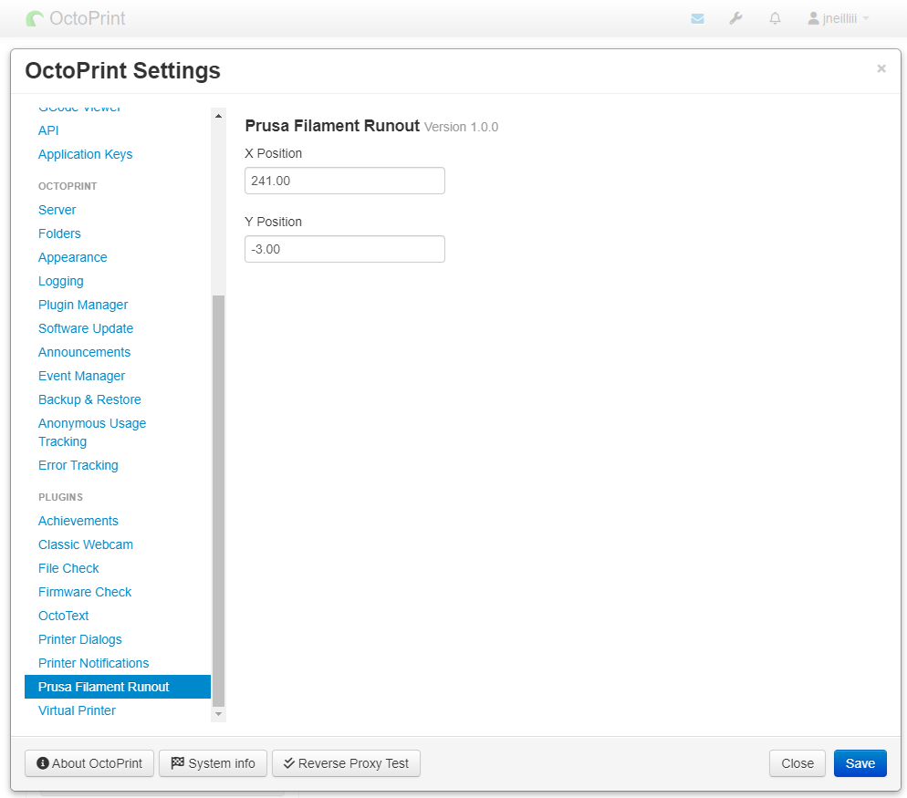

# Prusa Filament Runout Monitor

**This plugin exists thanks to generous funding by [Kaizen Smart Data Ltd.]().**

Plugin monitors Prusa Buddy firmware's (MK4, Mini, XL, MK3.9) serial communications for specific conditions that indicate
a filament runout on the printer and pauses the print job in OctoPrint.


**NOTE:** This plugin is not required for filament runout to function on these printers. It was made to allow other
plugins like [OctoText](https://plugins.octoprint.org/plugins/OctoText/) to be aware of when a filament runout occurs by
utilizing OctoPrint's pause functionality. This allows other plugins to notify on the pause event, which is not possible
with Prusa's current firmware implementation of filament runout.

## Settings

Configure the X and Y position for the parked position during filament runout in the plugin's settings. To determine what
the exact position is start a sacrificial print and cut the filament while looking at the terminal tab of
OctoPrint. You should see something reported from the printer like this:
```
echo:busy: processing
X:241.00 Y:-3.00 Z:38.90 E:89.28 Count X:24099 Y:-300 Z:15559
```
Use the values for X and Y as they appear in the second line of the above example, ie. `241.00` for X and `-3.00` for Y,
in the plugin's settings. This is how the plugin determines if the printer is in the parked position during filament
runout.



## Get Help

If you experience issues with this plugin or need assistance please use the issue tracker by clicking issues above.

### Additional Plugins

Check out my other plugins [here](https://plugins.octoprint.org/by_author/#jneilliii)

### Sponsors
- Andreas Lindermayr
- [@TheTuxKeeper](https://github.com/thetuxkeeper)
- [@tideline3d](https://github.com/tideline3d/)
- [SimplyPrint](https://simplyprint.io/)
- [Andrew Beeman](https://github.com/Kiendeleo)
- [Calanish](https://github.com/calanish)
- [Lachlan Bell](https://lachy.io/)
- [Jonny Bergdahl](https://github.com/bergdahl)
## Support My Efforts
I, jneilliii, programmed this plugin for fun and do my best effort to support those that have issues with it, please return the favor and leave me a tip or become a Patron if you find this plugin helpful and want me to continue future development.

[](https://www.patreon.com/jneilliii) [](https://paypal.me/jneilliii) [](https://github.com/sponsors/jneilliii)

<small>No paypal.me? Send funds via PayPal to jneilliii&#64;gmail&#46;com</small>
